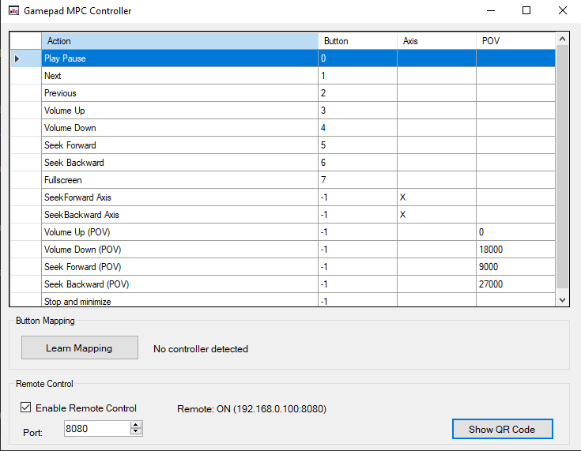
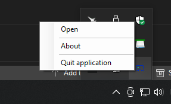

# Gamepad MPC Controller

A Windows tool that allows controlling Media Player Classic (MPC-HC and MPC-BE) using any DirectInput-compatible gamepad.  
Supports buttons, axes, and POV (hat switch) with fully customizable mappings.

## Download

A ready-to-use executable is available here:
https://github.com/tolotratlt/gamepad-mpc-controller/releases/tag/v1.0.0

## Features

- DirectInput support (SharpDX)
- Works with DualSense, Logitech gamepads, generic PC controllers and most HID devices
- Automatic input mapping via "Learn Mode"
- Conflict-free mapping (a button cannot be assigned to multiple actions)
- Axis mapping (seek via analog sticks)
- POV/Hat switch mapping (for volume or seek)
- Automatic disconnect/reconnect handling
- System tray integration (Open, About, Quit)
- About dialog included
- Full compatibility with MPC-HC and MPC-BE window classes
- Supported actions:
  - Play/Pause
  - Stop
  - Stop and Minimize
  - Next / Previous
  - Seek Forward / Seek Backward
  - Volume Up / Volume Down
  - Fullscreen
  - Axis-triggered Seek
  - POV-triggered Seek or Volume

## Screenshots

### Main Window


### Tray Menu


## Supported Media Players

The tool supports all known MPC window classes:

- Media Player Classic  
- Media Player Classic Home Cinema (MPC-HC)
- MPC-BE  
- MPC-BE x64  

This ensures compatibility with all modern and older MPC-HC and MPC-BE versions.

## Supported Controllers

Compatible with any DirectInput device, including:

- Sony DualSense (USB and Bluetooth)
- Logitech gamepads
- Generic HID controllers
- Legacy PC joysticks

The tool automatically:

- Detects the controller
- Polls buttons, axes and POV
- Reacquires devices when needed
- Reconnects after USB unplug or Bluetooth sleep

## Installation

1. Download or build the application.
2. Place the executable in any folder.
3. Run `GamepadMpcController.exe`.

If ILRepack was used, the program can run as a single portable `.exe`.  
Otherwise, keep `SharpDX.dll` and `SharpDX.DirectInput.dll` beside the executable.

## How to Use

### 1. Launching the app

When the program starts:

- The main configuration window opens
- A tray icon appears
- Status displays "Ready" or "No controller detected"
- Actions can be triggered immediately if a gamepad is connected

### 2. Mapping an action (Learn Mode)

1. Select an action in the grid.
2. Click **"Learn from the next action button"**.
3. Press a button on your gamepad.

The tool will:

- Assign the button to the selected action
- Remove the same button from any other action (conflict prevention)

Press **Escape** to cancel Learn Mode.

### 3. Removing a mapping

Select an action and press **Delete**.

### 4. Mapping axes

During Learn Mode, moving a stick or trigger sharply assigns one of:

- X, Y, Z
- Rx, Ry, Rz

Axis mapping is typically used for seek actions.

### 5. Mapping POV (Hat Switch)

Detected POV values:

- Up = 0
- Right = 9000
- Down = 18000
- Left = 27000

Useful for seek or volume control.

## System Tray Behavior

Closing the window hides the app to the notification area.  
Right-click the tray icon for:

- **Open** - restores the window  
- **About** - shows the About dialog  
- **Quit** - fully exits the application  

The program continues running in background until Quit is selected.


## Building

Open the project in Visual Studio and build normally.

To create a portable executable:

```cmd
ilrepack /out:GamepadMpcController_merged.exe GamepadMpcController.exe SharpDX.dll SharpDX.DirectInput.dll
```

This can be executed manually after each Release build.


## Planned Improvements

- Mapping profiles (save/load JSON)
- XInput support
- Adjustable seek/volume step size

## Credits

Developed by TLT
2025

Enjoy :]