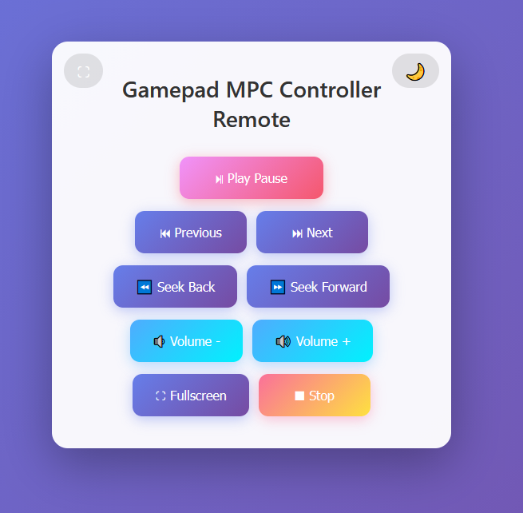

# Gamepad MPC Controller

A Windows tool that allows controlling Media Player Classic (MPC-HC and MPC-BE) and VLC using any DirectInput and XInput compatible gamepad.  
Supports buttons, axes, and POV (hat switch) with fully customizable mappings.

## Important note before first use

On first launch, **only the Play/Pause action is mapped by default**, using **button 0**.  
All other actions are **unmapped**.

You must configure your own button mappings using Learn Mapping before the controller and remote features can be fully used.

---

## Download

A ready to use executable is available here:  
https://github.com/tolotratlt/gamepad-mpc-controller/releases/tag/v1.2.0

---

## Features

- DirectInput and XInput support (SharpDX)
- Works with DualSense, Xbox, Xbox 360, Logitech gamepads, generic PC controllers and most HID devices
- Automatic input mapping via Learn Mode
- Conflict-free mapping (a button cannot be assigned to multiple actions)
- Axis mapping (seek via analog sticks)
- POV or hat switch mapping (for volume or seek)
- Automatic disconnect and reconnect handling
- System tray integration (Open, About, Quit)
- About dialog included
- Full compatibility with MPC-HC, MPC-BE and VLC
- Built-in WiFi remote control via web interface
- QR code generation for quick mobile access

Supported actions:
- Play / Pause
- Stop
- Stop and Minimize
- Next / Previous
- Seek Forward / Seek Backward
- Volume Up / Volume Down
- Fullscreen
- Axis-triggered Seek
- POV-triggered Seek or Volume

---

## Screenshots

### Main Window

### Tray Menu

### Remote Interface

---

## Supported Media Players

Tested and verified working with:

- MPC-HC 2.4.1 (from K-Lite Codec Pack)
- MPC 1.8.5 (Microsoft Store version)
- VLC 3.0.21 Vetinari

Detected window classes include:

- Media Player Classic
- Media Player Classic Home Cinema (MPC-HC)
- MPC-BE
- MPC-BE x64
- VLC

---

## Supported Controllers

Compatible with any DirectInput or XInput device, including:

- Sony DualSense (USB and Bluetooth)
- Xbox and Xbox 360 controllers (wired and wireless)
- Logitech gamepads
- Generic HID controllers
- Legacy PC joysticks

The tool automatically:

- Detects the controller
- Polls buttons, axes and POV
- Reacquires devices when needed
- Reconnects after USB unplug or Bluetooth sleep

---

## Installation

1. Download or build the application.
2. Place the executable in any folder.
3. Run GamepadMpcController.exe.

If ILRepack was used, the program can run as a single portable exe.  
Otherwise, keep the following files beside the executable:

- SharpDX.dll
- SharpDX.DirectInput.dll
- SharpDX.XInput.dll
- zxing.dll
- zxing.presentation.dll

---

## How to Use

### 1. Launching the app

When the program starts:

- The main configuration window opens
- A tray icon appears
- Status displays Ready or No controller detected
- Only Play/Pause is mapped by default

---

### 2. Mapping actions with Learn Mapping

1. Select an action in the grid.
2. Click Learn Mapping.
3. Press a button on your gamepad.

The tool will:

- Assign the button to the selected action
- Remove that button from any other action automatically

Press Escape to cancel Learn Mode.

---

### 3. Removing a mapping

Select an action and press Delete to clear its button assignment.

---

### 4. Mapping axes

During Learn Mapping, moving a stick or trigger sharply assigns one of:

- X, Y, Z
- Rx, Ry, Rz

Axis mapping is typically used for seek actions.

---

### 5. Mapping POV or hat switch

Detected POV values:

- Up = 0
- Right = 9000
- Down = 18000
- Left = 27000

Useful for seek or volume control.

---

## Remote Control (WiFi)

The application includes a built-in HTTP server that allows controlling the media player from any device on the local network.

### Enabling the remote

1. Open the application.
2. Go to the Remote Control section.
3. Check Enable Remote Control.
4. Choose a port if needed.
5. Click Show QR Code.

Scan the QR code with your phone or tablet to open the remote interface instantly.

---

### Remote interface usage

The web interface provides simple buttons for:

- Play / Pause
- Next / Previous
- Seek Forward / Seek Backward
- Volume Up / Volume Down
- Fullscreen
- Stop

The remote works on any device with a web browser and does not require installing an app.

---

### Notes about the remote

- The remote only works on the local network.
- If the selected port is already in use, the server will fail to start.
- Changing the port while the remote is active will restart the server automatically.

---

## System Tray Behavior

Closing the window hides the app to the notification area.  
Right-click the tray icon for:

- Open: restores the window
- About: shows the About dialog
- Quit: fully exits the application

The program continues running in background until Quit is selected.

---

## Building

Open the project in Visual Studio and build normally.

To create a portable executable:

ilrepack /out:GamepadMpcController_release.exe GamepadMpcController.exe SharpDX.dll SharpDX.DirectInput.dll SharpDX.XInput.dll zxing.dll zxing.presentation.dll

---

## Planned Improvements

- Mapping profiles (save and load JSON)
- Remote UI customization
- Multiple controller profiles

---

## Credits

Developed by TLT

Enjoy :)
